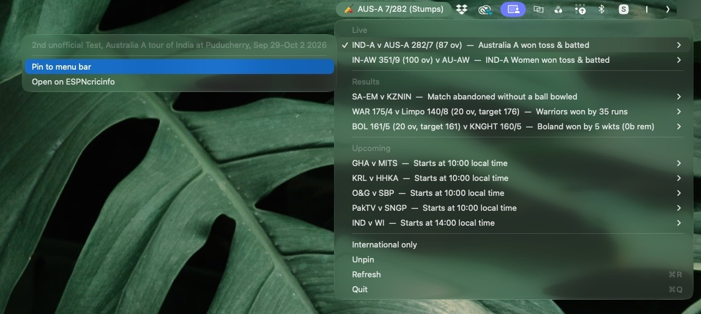

# Stumpbar

A tiny macOS menu bar app that shows cricket scores.




- Menu bar shows 🏏 plus the number of live matches, or the score of a match you pin.
- A pinned match shows the batting side as wickets/runs with over.ball, e.g. `AUS 7/282 (54.3)`,
  or the reason play has stopped, e.g. `(Stumps)`, `(Tea)`, `(Rain delay)`.
- Menu lists **Live**, **Results** and **Upcoming** matches; each has a submenu to pin it or open it on ESPNcricinfo.
- "International only" hides domestic/A-team games.
- **Wicket alerts** for the pinned match, with how the batter was out, e.g.
  *WICKET! AUS-A 7/277 (84.5) — Todd Murphy bowled Kamboj · 33 (91)*.
  macOS asks for permission on first launch; if you miss it, turn on Stumpbar under
  System Settings → Notifications.
- Refreshes every 15 seconds (⌘R to refresh now).

Scores come from ESPN's public (unofficial, undocumented) scoreboard feed — no API key needed, but it could change without notice.

## Install

```sh
./build.sh
```

This builds `dist/Stumpbar.app` and `dist/Stumpbar-1.0.0.dmg`. Open the DMG and drag
**Stumpbar** into **Applications**. It runs in the menu bar only (no Dock icon).

The app is ad-hoc signed, not notarized. On another Mac, macOS will block the first launch:
right-click the app → **Open**, or allow it under System Settings → Privacy & Security.

To start it at login: System Settings → General → Login Items → add Stumpbar.

## Run from source

```sh
python3 -m venv .venv
source .venv/bin/activate
pip install -r requirements.txt
python app.py
```

To just print current scores in the terminal: `python scores.py`.

Notifications need the app bundle, so test them with the built app:
`open dist/Stumpbar.app --args --demo-wicket` shows a sample wicket alert.

## Tests

```sh
pip install pytest
python -m pytest
```

## Licence

MIT — see [LICENSE](LICENSE). Bundled third-party software is listed in
[THIRD_PARTY_NOTICES.md](THIRD_PARTY_NOTICES.md).
